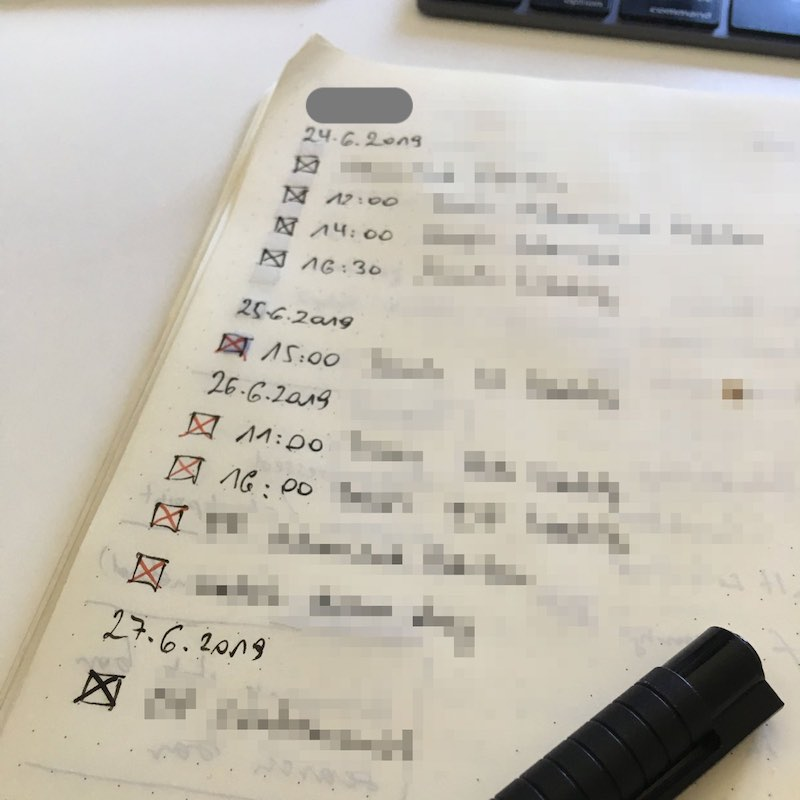
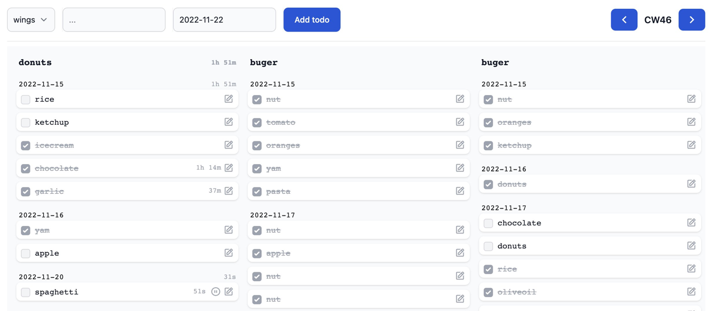

# Eddo

_GTD-inspired todo & time tracking with AI integration_

[](https://www.youtube.com/watch?v=jiWS9pP_cX0)

📺 [Watch the sneak peek intro on YouTube](https://www.youtube.com/watch?v=jiWS9pP_cX0)

**⚠️ Alpha Software**: This is a solo side project under active development. Feel free to try it and provide feedback, but expect rough edges, breaking changes, and don't rely on data integrity across updates.

## Overview

Eddo is a personal project that combines classic GTD (Getting Things Done) methodology with modern AI capabilities. Born from a notebook-based system refined over 10+ years, it's my attempt to digitize that workflow while exploring what's possible with AI assistants.

Manage todos through a web interface, Telegram bot with Claude AI, or programmatically via MCP. Includes [pi-coding-agent](https://buildwithpi.ai) integration with custom skills and extensions for AI-assisted development workflows.

|                         Inspiration                         |                     Eddo (initial 2022 verrsion)                      |
| :---------------------------------------------------------: | :-------------------------------------------------------------------: |
|  |  |

### Features

- **GTD Contexts** — Organize todos by context (work, home, projects) in Kanban columns
- **Calendar Week View** — Navigate todos by week with date-range queries
- **Time Tracking** — Start/pause timers with daily summaries
- **Offline-First** — PouchDB local storage with real-time sync
- **AI Agent** — Telegram bot with Claude for natural language todo management
- **GitHub Sync** — Auto-import issues assigned to you
- **RSS Feeds** — Subscribe to feeds, create todos from items
- **Email Sync** — Gmail OAuth integration for email-to-todo
- **MCP Server** — Programmatic access via Model Context Protocol
- **pi-coding-agent Skills** — AI coding assistant integration

## Quick Start

**Requirements**: Node.js ≥18.11.0, pnpm ≥7.1.0, Docker

```bash
# Clone repository
git clone https://github.com/walterra/eddoapp.git
cd eddoapp

# Optional: Use latest stable release instead of main branch
git checkout $(git describe --tags --abbrev=0)

# Install dependencies
pnpm install

# Run interactive setup wizard
pnpm dev:setup

# Start development server
pnpm dev

# Open http://localhost:3000
```

### What Setup Does

The `pnpm dev:setup` wizard:

1. **Checks prerequisites** — Node.js, pnpm, Docker, Git
2. **Starts Docker services** — CouchDB and Elasticsearch
3. **Generates `.env`** — Development defaults
4. **Builds packages** — Core libraries and setup tools
5. **Creates user** — `eddo_pi_agent` for MCP/agent access
6. **Links pi-coding-agent skills** — If pi is installed globally

### Troubleshooting

```bash
pnpm dev:doctor
```

Diagnoses: prerequisites, Docker status, service health, port availability, configuration.

## Architecture

Monorepo with these packages:

| Package        | Description                                     |
| -------------- | ----------------------------------------------- |
| `web-client`   | React frontend with PouchDB offline storage     |
| `web-api`      | Hono API server, CouchDB proxy, sync schedulers |
| `core-shared`  | Shared types, utilities, data models            |
| `core-server`  | Server-side database and config                 |
| `core-client`  | Client-side config                              |
| `mcp-server`   | Model Context Protocol server                   |
| `telegram-bot` | AI bot with Claude integration                  |
| `setup`        | Setup wizard and doctor tools                   |
| `chat-agent`   | Skills and extensions for pi-coding-agent       |

### Data Flow

```
Browser (PouchDB) ←→ Web API ←→ CouchDB
                         ↓
                  Elasticsearch (search)

Telegram Bot → MCP Server → CouchDB
```

## Integrations

### Telegram Bot

AI-powered assistant for natural language todo management:

```
"Add a work todo for tomorrow's meeting"
"What's overdue?"
"Start tracking time on the API refactor"
```

**Setup**: Set `TELEGRAM_BOT_TOKEN` and `ANTHROPIC_API_KEY` in `.env`

```bash
pnpm dev:telegram-bot
```

Features:

- Multi-step instruction handling
- Daily briefings at scheduled times
- GitHub/RSS/Email sync configuration via bot commands

### GitHub Issue Sync

Sync issues assigned to you into Eddo todos:

1. Create PAT at https://github.com/settings/tokens (scope: `repo` or `public_repo`)
2. Configure: `/github token ghp_your_token`
3. Enable: `/github on`
4. Check: `/github status`

Each repository becomes its own context. Issues auto-complete when closed on GitHub.

### RSS Feed Sync

Subscribe to RSS/Atom feeds:

1. Add feed: `/rss add https://example.com/feed.xml`
2. Enable: `/rss on`
3. List feeds: `/rss list`

Supports autodiscovery — add a website URL and Eddo finds the feed.

### Email Sync (Gmail)

Sync emails from a designated folder to todos:

1. Start OAuth: `/email auth`
2. Authorize in browser
3. Enable: `/email on`
4. Set folder: `/email folder Eddo`

Requires Google Cloud project setup. See [Gmail OAuth Setup](docs/gmail-oauth-setup.md).

### MCP Server

Programmatic todo access via Model Context Protocol:

```bash
pnpm dev:mcp-server
pnpm test:mcp-server  # Interactive testing
```

> **Note**: The MCP server uses a simple `X-User-ID` header without verification. Don't expose to untrusted networks.

### pi-coding-agent Integration

If you use [pi-coding-agent](https://github.com/mariozechner/pi-coding-agent), Eddo provides skills and extensions:

**Skills:**

- `eddo-todo` — Task management commands
- `eddo-work` — Structured implementation workflow
- `eddo-spawn` — Multi-agent git worktree orchestration
- `elasticsearch-esql` — ES|QL query generation
- `searxng-search` — Web search integration

**Extensions:**

- `graphviz-chart` — Diagram rendering
- `vega-chart` — Data visualization

The setup wizard auto-links these if pi is installed globally (`npm i -g @mariozechner/pi-coding-agent`).

## Backup & Recovery

```bash
# Interactive backup/restore
pnpm backup:interactive
pnpm restore:interactive

# Automated backups
pnpm backup:auto --pattern "eddo_user_*"

# Retention policy
pnpm backup:retention
```

See [Disaster Recovery Guide](docs/07_disaster-recovery.md).

## Development

```bash
pnpm dev              # Start all services
pnpm test             # Run tests
pnpm lint             # Check code style
pnpm build            # Production build
pnpm dev:create-user  # Create user manually
```

See [DEVELOPMENT.md](DEVELOPMENT.md) for architecture details, testing, and contribution guidelines.

## License

MIT
