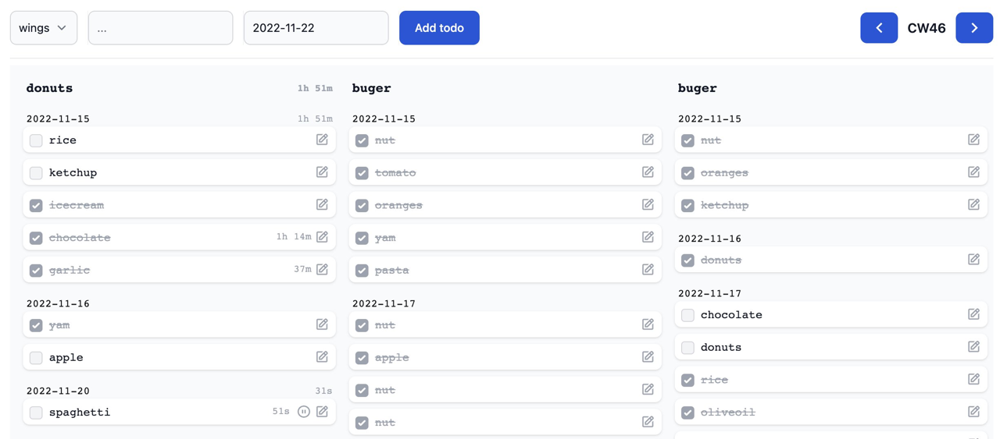

# Eddo

_Todos & time tracking_

Consider this an alpha state proof of concept for now. I encourage you to give it a try and I'd love to hear your feedback, but don't expect 100% data integrity across updates.

## Setup

- Clone the repository
- Run `pnpm install` (or `npm install` if you don't use `pnpm`).
- Run `pnpm dev` to give it a try as is on your local machine.
- Run `pnpm build` to create a production build which you can deploy/use to your liking.

