# Graphviz DOT Language Reference

Graphviz is a powerful tool for creating diagrams and visual representations of graphs using the DOT language. This reference covers the essential syntax, attributes, and patterns for creating effective diagrams.

## Basic Structure

### Graph Types

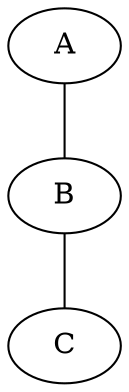

### Comments

```dot
// Single line comment
/* Multi-line
   comment */
# Preprocessor-style comment (line must start with #)
```

## Nodes

### Basic Node Declaration

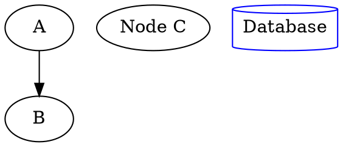

### Node Shapes

**Common shapes:**

- `box`, `rect`, `rectangle` - Rectangular
- `ellipse`, `oval` - Elliptical (default)
- `circle`, `doublecircle` - Circular
- `diamond` - Diamond
- `plaintext`, `plain`, `none` - No border
- `point` - Small circle
- `triangle`, `invtriangle` - Triangular
- `house`, `invhouse` - House-shaped
- `pentagon`, `hexagon`, `septagon`, `octagon` - Polygons
- `cylinder` - Database/storage
- `note` - Document note
- `folder`, `tab` - File system
- `box3d` - 3D box
- `component` - UML component
- `star` - Star shape
- `record` - Record with fields (use HTML labels instead)

**Example:**

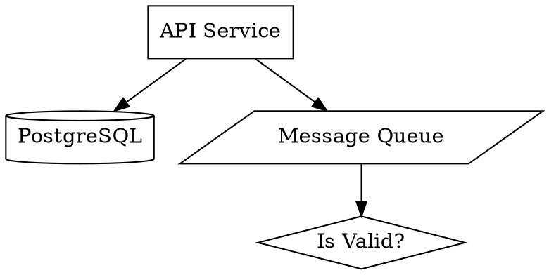

### Node Styles

```dot
node [style=filled];           // Filled background
node [style=dashed];           // Dashed border
node [style=dotted];           // Dotted border
node [style=bold];             // Bold border
node [style=rounded];          // Rounded corners (for box)
node [style="filled,rounded"]; // Multiple styles
node [style=invis];            // Invisible
```

## Edges

### Edge Types

```dot
// Directed edge
A -> B;

// Undirected edge (in graph, not digraph)
A -- B;

// Chain of edges
A -> B -> C -> D;

// Multiple targets
A -> {B C D};

// Edge with label
A -> B [label="sends data"];
```

### Edge Attributes

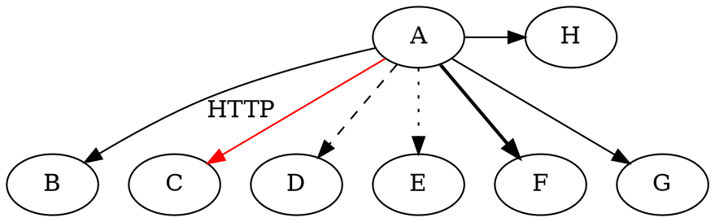

### Arrow Types

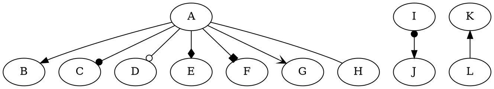

**Arrow modifiers:**

- `o` prefix: open (hollow) - `odot`, `odiamond`
- `l`/`r` prefix: left/right half - `lnormal`, `rnormal`
- Combinations: `obox`, `olnormal`

## Attributes

### Graph Attributes

```dot
digraph G {
    // Layout direction
    rankdir=LR;    // Left to Right
    rankdir=TB;    // Top to Bottom (default)
    rankdir=BT;    // Bottom to Top
    rankdir=RL;    // Right to Left

    // Spacing
    ranksep=0.5;   // Rank separation (inches)
    nodesep=0.5;   // Node separation (inches)

    // Background
    bgcolor=lightgrey;

    // Size constraints
    size="10,10";  // Max size in inches
    ratio=fill;    // Fill the size

    // Font defaults
    fontname="Helvetica";
    fontsize=12;

    // Label (graph title)
    label="System Architecture";
    labelloc=t;    // Top (t), bottom (b)
    labeljust=l;   // Left (l), center (c), right (r)
}
```

### Node Attributes

| Attribute   | Description                        | Example               |
| ----------- | ---------------------------------- | --------------------- |
| `label`     | Display text                       | `label="Web Server"`  |
| `shape`     | Node shape                         | `shape=box`           |
| `color`     | Border color                       | `color=red`           |
| `fillcolor` | Fill color (requires style=filled) | `fillcolor=lightblue` |
| `style`     | Visual style                       | `style=filled`        |
| `fontname`  | Font family                        | `fontname="Arial"`    |
| `fontsize`  | Font size in points                | `fontsize=14`         |
| `fontcolor` | Text color                         | `fontcolor=white`     |
| `width`     | Minimum width (inches)             | `width=2`             |
| `height`    | Minimum height (inches)            | `height=1`            |
| `penwidth`  | Border thickness                   | `penwidth=2.0`        |
| `tooltip`   | Hover text (SVG)                   | `tooltip="Click me"`  |
| `URL`       | Clickable link (SVG)               | `URL="https://..."`   |

### Edge Attributes

| Attribute    | Description                                  | Example            |
| ------------ | -------------------------------------------- | ------------------ |
| `label`      | Edge label                                   | `label="HTTP"`     |
| `color`      | Edge color                                   | `color=blue`       |
| `style`      | Line style                                   | `style=dashed`     |
| `arrowhead`  | Head arrow style                             | `arrowhead=vee`    |
| `arrowtail`  | Tail arrow style                             | `arrowtail=dot`    |
| `dir`        | Arrow direction                              | `dir=both`         |
| `penwidth`   | Line thickness                               | `penwidth=2.0`     |
| `weight`     | Layout weight (higher = shorter, straighter) | `weight=2`         |
| `constraint` | Affects ranking                              | `constraint=false` |
| `minlen`     | Minimum edge length (ranks)                  | `minlen=2`         |
| `headlabel`  | Label at head                                | `headlabel="1"`    |
| `taillabel`  | Label at tail                                | `taillabel="*"`    |

## Colors

### Named Colors (X11 Scheme)

Common colors: `red`, `blue`, `green`, `yellow`, `orange`, `purple`, `pink`, `brown`, `black`, `white`, `gray`, `grey`

Light variants: `lightblue`, `lightgreen`, `lightyellow`, `lightgray`
Dark variants: `darkblue`, `darkgreen`, `darkred`, `darkgray`

### Hex Colors

```dot
node [fillcolor="#3b82f6"];  // Blue
node [color="#ef4444"];       // Red
```

### RGB/RGBA

```dot
node [fillcolor="0.5 0.8 0.2"];  // HSB format
```

## Subgraphs and Clusters

### Basic Subgraph

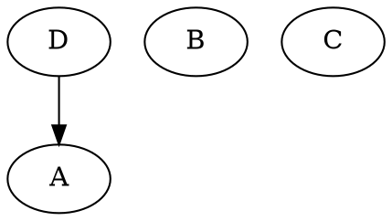

### Clusters (Named subgraphs starting with "cluster")

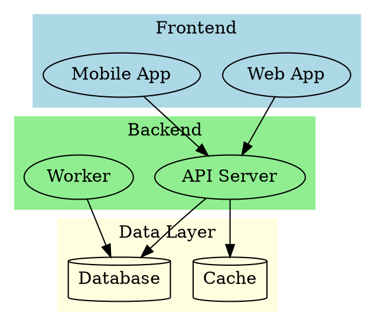

### Rank Constraints

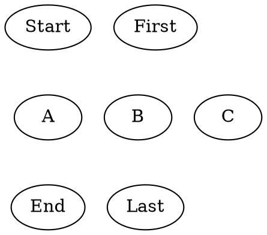

## Common Patterns

### Flowchart

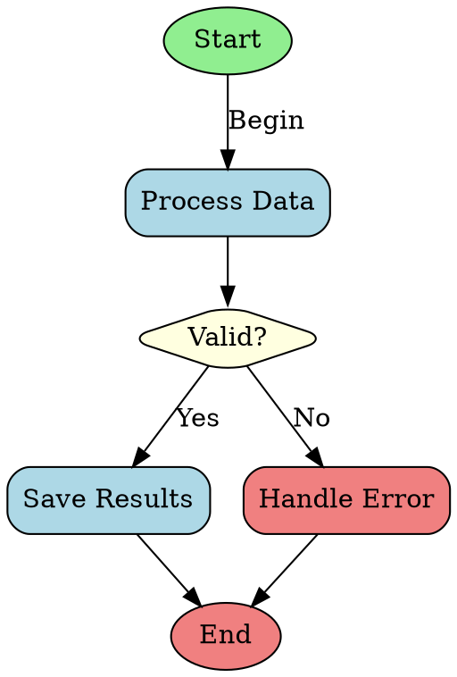

### Architecture Diagram

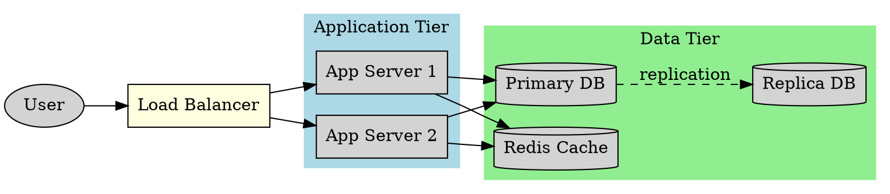

### Sequence-like Diagram

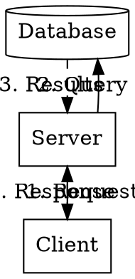

### State Machine

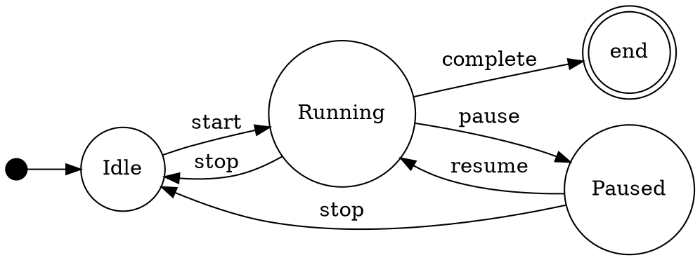

### Dependency Graph

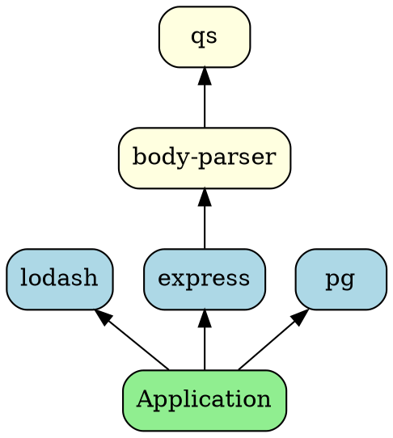

### ER Diagram (using HTML labels)

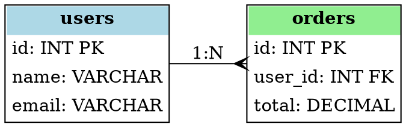

## Layout Engines

Graphviz includes several layout engines:

| Engine      | Best For                        | Direction |
| ----------- | ------------------------------- | --------- |
| `dot`       | Hierarchical graphs, DAGs       | TB/LR     |
| `neato`     | Undirected graphs, spring model | Any       |
| `fdp`       | Large undirected graphs         | Any       |
| `sfdp`      | Very large graphs               | Any       |
| `twopi`     | Radial layouts                  | Radial    |
| `circo`     | Circular layouts                | Circular  |
| `osage`     | Clustered graphs                | -         |
| `patchwork` | Treemaps                        | -         |

Specify with command line: `dot -Kneato -Tpng input.dot -o output.png`

## Best Practices

1. **Use meaningful IDs**: `web_server` not `n1`
2. **Group related nodes**: Use clusters for visual organization
3. **Control direction**: `rankdir=LR` for wide diagrams, `TB` for tall
4. **Use consistent styling**: Set defaults with `node [...]` and `edge [...]`
5. **Label edges**: Make relationships clear
6. **Use colors purposefully**: Highlight important nodes/paths
7. **Keep it simple**: Don't overcrowd; split complex diagrams
8. **Use constraint=false**: For edges that shouldn't affect layout
9. **Adjust spacing**: Use `ranksep` and `nodesep` for readability
10. **Test with different engines**: `dot` vs `neato` can give very different results

## Critical Rendering Issues

### HTML TABLE Labels Break Kerning

**Problem:** Using `<TABLE>` in HTML labels causes Pango to render each cell separately, destroying letter spacing (kerning).

**Symptom:** Text like "eddo-telegram-bot" has uneven letter spacing.

```dot
// ❌ BAD - TABLE breaks kerning
node [label=<<TABLE><TR><TD><FONT>Service Name</FONT></TD></TR></TABLE>>]

// ✅ GOOD - Simple HTML with BR preserves kerning
node [label=<Service Name<BR/><FONT POINT-SIZE="10" COLOR="#737373">subtitle</FONT>>]
```

**Rule:** Only use `<TABLE>` when you need multi-column alignment. For simple multi-line labels, use `<BR/>`.

### DPI for Crisp Output

**Problem:** Default 96 DPI produces fuzzy text on modern displays.

**Solution:** Set high DPI in graph attributes:

```dot
digraph G {
    dpi=192;  // 2x for retina displays
    // or dpi=300 for print quality
}
```

**Note:** Higher DPI increases file size proportionally.

### Font Selection and Rendering

**Problem:** Graphviz uses fontconfig which matches font names loosely. "Helvetica Neue" might fall back to something unexpected.

**Solution:** Use widely-available fonts:

```dot
graph [fontname="Arial" fontsize=14];
node [fontname="Arial" fontsize=12];
edge [fontname="Arial" fontsize=10];
```

**Safe fonts:** Arial, Helvetica, Times, Courier, Georgia, Verdana

### Edge Labels with Ortho Splines

**Problem:** Edge labels may not appear when using `splines=ortho`.

**Solution:** Use `splines=true` (curved) or `splines=line` (straight) when labels are important.

## Visual Design Principles

### Minimalist (Data-Ink Ratio)

Maximize data, minimize non-data ink:

- Remove decorative borders if they don't encode information
- Use line weight to encode traffic/volume
- Avoid chartjunk (3D effects, gradients, unnecessary fills)
- Every pixel should convey data

**When to apply:** Technical documentation, data-dense dashboards, publications.

**Limitation:** Can be too minimal for audiences who need visual anchors.

### Communicative (Functional Clarity)

Emphasize communication over minimalism:

- **Functional decoration is not chartjunk** — borders and shapes aid parsing
- **Redundant encoding for critical data** — error states need color + icon + size
- **Know your audience** — label for the least technical viewer
- **Guide the eye** — create visual hierarchy that leads to the insight

**When to apply:** Operational dashboards, presentations to mixed audiences, alerting systems.

### Modern SaaS (Clean Professional)

Clean, professional design for modern tooling:

- **White space is design** — let elements breathe
- **One accent color** — gray scale for structure, color for emphasis
- **No gradients, no shadows** — flat, honest design
- **Typography carries hierarchy** — weight and size, not decoration
- **Thin lines, subtle borders** — 1px borders, never black

**When to apply:** Product documentation, engineering blogs, modern tooling.

### Choosing an Approach

| Audience               | Approach      | Style                     |
| ---------------------- | ------------- | ------------------------- |
| Engineers reading docs | Minimalist    | Minimal, data-dense       |
| Ops team monitoring    | Communicative | Clear, redundant encoding |
| Product/stakeholders   | Modern SaaS   | Clean, professional       |
| Print/publication      | Minimalist    | High information density  |

## Professional Theming

### Light Theme (SaaS Style)

```dot
digraph G {
    bgcolor="white";
    dpi=192;
    pad=0.5;

    graph [fontname="Arial" fontsize=14 fontcolor="#404040"];
    node [fontname="Arial" fontsize=12 fontcolor="#171717"];
    edge [fontname="Arial" fontsize=9 fontcolor="#525252" color="#a3a3a3"];

    // Entry points (ellipse)
    users [label="Users" shape=ellipse style=filled fillcolor="#f5f5f5" color="#d4d4d4"];

    // Services (rounded box)
    api [label=<api-server<BR/><FONT POINT-SIZE="10" COLOR="#525252">572K traces</FONT>>
         shape=box style="rounded" color="#d4d4d4"];

    // Error state (red accent)
    problem [label=<problem-service<BR/><FONT POINT-SIZE="10" COLOR="#dc2626">8% errors</FONT>>
             shape=box style="rounded,filled" fillcolor="#fef2f2" color="#dc2626" penwidth=2];

    // Data layer (cylinder)
    db [label="Database" shape=cylinder style=filled fillcolor="#fafafa" color="#d4d4d4"];

    // External (dashed)
    external [label="External APIs" shape=box style="dashed,rounded" color="#a3a3a3"];
}
```

**Light palette:**
| Element | Color |
|---------|-------|
| Background | `#ffffff` |
| Node fill | `#f5f5f5` / `#fafafa` |
| Node border | `#d4d4d4` |
| Primary text | `#171717` |
| Secondary text | `#525252` |
| Muted text | `#737373` |
| Edges | `#a3a3a3` |
| Error fill | `#fef2f2` |
| Error border | `#dc2626` |

### Dark Theme

```dot
digraph G {
    bgcolor="#0a0a0a";
    dpi=192;
    pad=0.5;

    graph [fontname="Arial" fontsize=14 fontcolor="#a3a3a3"];
    node [fontname="Arial" fontsize=12 fontcolor="#e5e5e5"];
    edge [fontname="Arial" fontsize=9 fontcolor="#737373" color="#525252"];

    // Entry points
    users [label="Users" shape=ellipse style=filled fillcolor="#1c1c1c" color="#404040" fontcolor="#a3a3a3"];

    // Services
    api [label=<api-server<BR/><FONT POINT-SIZE="10" COLOR="#a3a3a3">572K traces</FONT>>
         shape=box style="rounded,filled" fillcolor="#171717" color="#404040"];

    // Error state (red glow on dark)
    problem [label=<problem-service<BR/><FONT POINT-SIZE="10" COLOR="#f87171">8% errors</FONT>>
             shape=box style="rounded,filled" fillcolor="#1f1315" color="#dc2626" penwidth=2 fontcolor="#fecaca"];

    // Data layer
    db [label="Database" shape=cylinder style=filled fillcolor="#1c1c1c" color="#404040"];

    // External
    external [label="External APIs" shape=box style="dashed,rounded,filled" fillcolor="#0a0a0a" color="#525252"];
}
```

**Dark palette:**
| Element | Color |
|---------|-------|
| Background | `#0a0a0a` |
| Node fill | `#171717` / `#1c1c1c` |
| Node border | `#404040` |
| Primary text | `#e5e5e5` |
| Secondary text | `#a3a3a3` |
| Muted text | `#737373` |
| Edges | `#525252` |
| Error fill | `#1f1315` |
| Error border | `#dc2626` |
| Error text | `#f87171` (lighter for contrast) |

## Edge Label Strategy

### When to Label Edges

Apply the principle: **Label only what deviates from expectation.**

| Label Type  | Keep? | Reason                           |
| ----------- | ----- | -------------------------------- |
| HTTP/REST   | ❌    | Assumed between web services     |
| CRUD/SQL    | ❌    | Assumed for database connections |
| IPC         | ✅    | Surprising — not HTTP            |
| webhook     | ✅    | Notable — async external         |
| oauth       | ✅    | Specific authentication flow     |
| gRPC        | ✅    | Different from default HTTP      |
| async/queue | ✅    | Different execution model        |

### Edge Label Styling

Keep labels subordinate to nodes:

```dot
edge [fontname="Arial" fontsize=9 fontcolor="#737373"];

A -> B [label="http"];     // Only if audience needs it
A -> C [label="ipc"];      // Notable - different protocol
A -> D [label="webhook"];  // Notable - async pattern
```

## Complete Architecture Example

````dot
digraph EdDoArchitecture {
    rankdir=TB;
    splines=true;
    nodesep=0.9;
    ranksep=0.85;
    bgcolor="white";
    pad=0.5;
    dpi=192;

    // Typography
    graph [fontname="Arial" fontsize=14 fontcolor="#404040"];
    node [fontname="Arial" fontsize=12 fontcolor="#171717"];
    edge [fontname="Arial" fontsize=9 fontcolor="#525252" color="#a3a3a3" arrowsize=0.6 arrowhead=vee];

    // Title with insight (communicative: guide the eye)
    labelloc=t;
    label=<Service Architecture<BR/><FONT POINT-SIZE="11" COLOR="#737373">telegram-bot error rate needs attention</FONT>>;

    // Entry points (distinct shape)
    web_users [label="Web Users" shape=ellipse style=filled fillcolor="#f5f5f5" color="#d4d4d4" fontsize=11];
    telegram_users [label="Telegram Users" shape=ellipse style=filled fillcolor="#f5f5f5" color="#d4d4d4" fontsize=11];

    // Services - size encodes importance (minimalist: data in the ink)
    web_client [
        label=<web-client<BR/><FONT POINT-SIZE="10" COLOR="#525252">11K traces</FONT>>
        shape=box style="rounded" color="#d4d4d4" penwidth=1
    ];

    // Error state: redundant encoding (communicative)
    telegram_bot [
        label=<telegram-bot<BR/><FONT POINT-SIZE="11" COLOR="#dc2626"><B>97K · 8% errors</B></FONT>>
        shape=box style="rounded,filled" fillcolor="#fef2f2" color="#dc2626" penwidth=2
        fontsize=13
    ];

    web_api [
        label=<web-api<BR/><FONT POINT-SIZE="10" COLOR="#525252">572K traces</FONT>>
        shape=box style="rounded" color="#d4d4d4" penwidth=1
        fontsize=14
    ];

    mcp_server [
        label=<mcp-server<BR/><FONT POINT-SIZE="10" COLOR="#525252">32K traces</FONT>>
        shape=box style="rounded" color="#d4d4d4" penwidth=1
    ];

    // Data layer (distinct shape)
    couchdb [
        label=<CouchDB<BR/><FONT POINT-SIZE="10" COLOR="#525252">225K queries</FONT>>
        shape=cylinder style=filled fillcolor="#fafafa" color="#d4d4d4"
    ];

    // External (clearly outside system boundary)
    external [
        label=<External APIs<BR/><FONT POINT-SIZE="9" COLOR="#737373">Telegram · Google · GitHub</FONT>>
        shape=box style="dashed,rounded" color="#a3a3a3"
    ];

    // Layout control
    {rank=same; web_users; telegram_users;}
    {rank=same; web_client; telegram_bot;}
    {rank=same; web_api; mcp_server;}

    // Edges - weight encodes traffic (minimalist)
    web_users -> web_client [penwidth=1];
    telegram_users -> telegram_bot [penwidth=1];

    // Label only what's notable (not "http" - assumed)
    web_client -> web_api [penwidth=1.5 label="http"];
    telegram_bot -> web_api [penwidth=2 label="http"];

    // IPC is notable
    web_api -> mcp_server [penwidth=1 dir=both arrowsize=0.45 constraint=false label="ipc"];

    // Database (no labels - CRUD assumed)
    web_api -> couchdb [penwidth=2.5];
    telegram_bot -> couchdb [penwidth=1.2];
    mcp_server -> couchdb [penwidth=1];

    // External (dashed = crosses boundary)
    telegram_bot -> external [penwidth=0.75 color="#b5b5b5" style=dashed constraint=false label="webhook"];
    web_api -> external [penwidth=0.75 color="#b5b5b5" style=dashed constraint=false label="oauth"];
}

## Output Formats

Common formats: `png`, `svg`, `pdf`, `ps`, `json`, `dot` (canonical)

```bash
# PNG output
dot -Tpng input.dot -o output.png

# SVG output (best for web, scalable)
dot -Tsvg input.dot -o output.svg

# PDF output
dot -Tpdf input.dot -o output.pdf
````

## Quick Reference: Quality Checklist

Before finalizing any diagram, verify:

- [ ] **DPI set to 192+** for crisp text
- [ ] **Font explicitly set** to Arial or Helvetica
- [ ] **No TABLE in HTML labels** (use BR instead for kerning)
- [ ] **Font sizes 10pt+** for readability
- [ ] **Edge labels only for surprising protocols** (skip HTTP, CRUD)
- [ ] **Error states use redundant encoding** (color + fill + size)
- [ ] **Shapes distinguish categories** (ellipse=users, box=services, cylinder=data)
- [ ] **splines=true or splines=line** if edge labels needed
- [ ] **Accessibility:** contrast ratio 4.5:1+ for text

## References

- [DOT Language Specification](https://graphviz.org/doc/info/lang.html)
- [Node Shapes](https://graphviz.org/doc/info/shapes.html)
- [Attributes Reference](https://graphviz.org/doc/info/attrs.html)
- [Color Names](https://graphviz.org/doc/info/colors.html)
- [Arrow Shapes](https://graphviz.org/doc/info/arrows.html)
- [Gallery](https://graphviz.org/gallery/)

### Visual Design References

- _The Visual Display of Quantitative Information_ (data-ink ratio, minimalist approach)
- _The Functional Art_, _How Charts Lie_ (clarity over minimalism, communicative approach)
- [Observable](https://observablehq.com/) (modern SaaS aesthetics, D3.js patterns)
