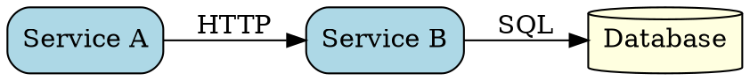
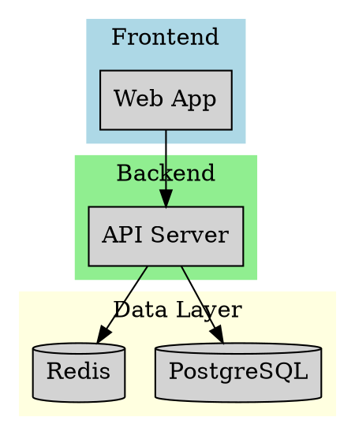
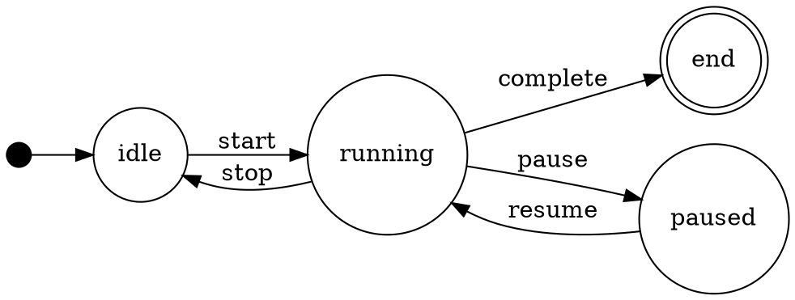

# Elasticsearch ES|QL

Generate ES|QL queries from natural language descriptions and execute them against Elasticsearch.

> **For visualization tasks:** Always read [references/vega-lite-reference.md](references/vega-lite-reference.md) first. It contains the complete grammar of graphics including data types, encoding channels, mark types, multi-view composition (layer, facet, concat, repeat), and professional best practices.

> **For architecture diagrams:** Use the `graphviz_chart` tool with DOT syntax. Best for flowcharts, dependency graphs, state machines, and system architecture diagrams. Always read [references/graphviz-reference.md](references/graphviz-reference.md) for complete syntax, node shapes, edge styles, and layout patterns.

## What is ES|QL?

ES|QL (Elasticsearch Query Language) is a piped query language for Elasticsearch. It is **NOT** the same as:

- Elasticsearch Query DSL (JSON-based)
- SQL
- EQL (Event Query Language)

ES|QL uses pipes (`|`) to chain commands: `FROM index | WHERE condition | STATS aggregation BY field | SORT field | LIMIT n`

> **Version Compatibility:** ES|QL was introduced in 8.11 (tech preview) and became GA in 8.14. Features like `LOOKUP JOIN`, `MATCH`, and `INLINESTATS` were added in later versions. Check [references/esql-version-history.md](references/esql-version-history.md) for feature availability by version.

## Container Environment

Inside Docker containers, the skill is available at:

```bash
ESQL="{baseDir}/esql.js"
```

### Environment Configuration

Elasticsearch connection is configured via environment variables (set by the container):

```bash
# Option 1: Elastic Cloud (recommended)
export ELASTICSEARCH_CLOUD_ID="deployment-name:base64encodedcloudid"
export ELASTICSEARCH_API_KEY="base64encodedapikey"

# Option 2: Direct URL with API Key
export ELASTICSEARCH_URL="https://elasticsearch:9200"
export ELASTICSEARCH_API_KEY="base64encodedapikey"

# Option 3: Basic Auth
export ELASTICSEARCH_URL="https://elasticsearch:9200"
export ELASTICSEARCH_USERNAME="elastic"
export ELASTICSEARCH_PASSWORD="changeme"

# Optional: Skip TLS verification (development only)
export ELASTICSEARCH_INSECURE="true"
```

## Usage

### Generate Query Only (for review)

```bash
$ESQL generate "show me the top 10 errors from logs in the last 24 hours"
```

### Get Index Information (for schema discovery)

```bash
$ESQL indices                    # List all indices
$ESQL indices "logs-*"           # List matching indices
$ESQL schema "logs-2024.01.01"   # Get field mappings for an index
```

### Execute Raw ES|QL

```bash
$ESQL raw "FROM logs-* | STATS count = COUNT(*) BY host.name | SORT count DESC | LIMIT 5"
```

### Execute with TSV Output (for charting)

```bash
$ESQL raw "FROM logs-* | STATS count = COUNT(*) BY component | SORT count DESC" --tsv
```

**TSV Output Options:**

- `--tsv` or `-t`: Output as tab-separated values (clean, no decorations)
- `--no-header`: Omit the header row

### Test Connection

```bash
$ESQL test
```

## Visualization with vega_chart Tool

The `vega_chart` extension renders Vega-Lite specifications as PNG images directly in your terminal. This gives you **full control** over visualization design using the declarative grammar of graphics.

> **Important:** Before creating any charts, read the complete [Vega-Lite Reference](references/vega-lite-reference.md) for data types, encoding channels, mark types, multi-view composition patterns, and best practices.

### Why Vega-Lite?

Rather than rigid chart types, Vega-Lite provides a **grammar of graphics**:

- Declarative: Describe _what_ you want, not _how_ to draw it
- Composable: Layer, facet, concatenate, and repeat views
- Professional: Control over every visual detail

### Basic Workflow

1. **Get TSV data** from esql.js using `--tsv` flag
2. **Transform field names** - rename dot-notation fields to simple names (see Critical Pitfalls)
3. **Construct a Vega-Lite spec** (JSON) with inline data
4. **Call vega_chart tool** with the spec

### Critical Pitfalls

> ⚠️ **These issues WILL break your charts. Read carefully.**

#### 1. Dot-Notation Field Names Break Everything

**Problem:** ES|QL returns fields like `room.name`, `host.ip`, `metric.value`. Vega-Lite interprets dots as nested object paths, looking for `{room: {name: value}}` instead of `{"room.name": value}`.

**Symptom:** Axis labels show "undefined", bars collapse into single row, legends show "undefined".

**Solution:** Always use inline data with renamed fields:

```json
// ❌ WRONG - will show "undefined"
{
  "data": {"values": [{"room.name": "Kitchen", "temp": 21}]},
  "encoding": {"y": {"field": "room.name"}}
}

// ✅ CORRECT - use simple field names
{
  "data": {"values": [{"room": "Kitchen", "temp": 21}]},
  "encoding": {"y": {"field": "room"}}
}
```

**Workflow:** Query ES|QL → Copy values → Create inline data with renamed fields.

#### 2. TSV Data with Complex Fields

When using `tsv_data` parameter, field names with dots will fail. **Always use inline `data.values` instead** and manually construct the data array with clean field names.

#### 3. Horizontal Bar Chart Labels Get Truncated

**Problem:** Y-axis labels on horizontal bar charts get cut off by default.

**Solution:** Add `labelLimit` to axis config:

```json
"encoding": {
  "y": {
    "field": "category",
    "axis": {"labelLimit": 200}
  }
}
```

#### 4. Facet/Repeat Syntax Incompatible with Altair v6

**Problem:** Top-level `facet` and `repeat` with `spec` don't work in the vega_chart renderer (uses Altair v6).

**Solution:** Use encoding-based faceting instead:

```json
// ❌ WRONG - facet at top level fails
{
  "facet": {"column": {"field": "region"}},
  "spec": {"mark": "line", ...}
}

// ✅ CORRECT - use column/row in encoding
{
  "mark": "line",
  "encoding": {
    "column": {"field": "region", "type": "nominal"},
    "x": {...},
    "y": {...}
  }
}
```

### Simple Examples

**Horizontal Bar Chart (with proper label handling):**

```json
{
  "$schema": "https://vega.github.io/schema/vega-lite/v5.json",
  "width": 400,
  "height": 250,
  "data": {
    "values": [
      { "category": "Category A", "value": 28 },
      { "category": "Category B", "value": 55 }
    ]
  },
  "mark": { "type": "bar", "cornerRadiusEnd": 3 },
  "encoding": {
    "y": {
      "field": "category",
      "type": "nominal",
      "sort": "-x",
      "title": null,
      "axis": { "labelLimit": 150 }
    },
    "x": { "field": "value", "type": "quantitative", "title": "Count" }
  }
}
```

**Time Series (with proper aspect ratio):**

```json
{
  "width": 600,
  "height": 200,
  "layer": [
    { "mark": { "type": "area", "opacity": 0.3 } },
    { "mark": { "type": "line", "strokeWidth": 2 } },
    { "mark": { "type": "point", "filled": true, "size": 40 } }
  ],
  "encoding": {
    "x": { "field": "date", "type": "temporal", "axis": { "format": "%b %d" } },
    "y": { "field": "value", "type": "quantitative" }
  }
}
```

### Best Practices

1. **Always use inline data** with simple field names - never rely on TSV with dot-notation
2. **Use vertical bar charts** when you have many categories - labels display more reliably
3. **Time series: 3:1 or 4:1 aspect ratio** - wide, not tall
4. **Direct labeling** over legends - place text labels at line endpoints
5. **Never use pie/donut charts** - use sorted bar charts instead
6. **Color encodes data, not decoration** - use single color for single-series data
7. **Sort by value** (`"sort": "-x"`) not alphabetically

### Full Reference (Required Reading)

**Always read [Vega-Lite Reference](references/vega-lite-reference.md) before creating visualizations.** It contains:

- Data types (N, O, Q, T) and when to use each
- Complete encoding channels (position, color, size, shape, etc.)
- All mark types (bar, line, point, area, rect, boxplot, etc.)
- Scale and axis configuration
- Multi-view composition (layer, hconcat, vconcat) for dashboards
- Professional chart patterns with complete working examples
- Common pitfalls and solutions

## Architecture Diagrams with Graphviz

The `graphviz_chart` extension renders Graphviz DOT specifications as PNG images. Use it for:

- System architecture diagrams
- Data flow diagrams
- Dependency graphs
- State machines
- Flowcharts
- ER diagrams

> **Important:** Before creating diagrams, read the complete [Graphviz Reference](references/graphviz-reference.md) for DOT syntax, node shapes, edge styles, clusters, and layout engines.

### Basic Usage

Call `graphviz_chart` with a DOT specification:



### When to Use Graphviz vs Vega-Lite

| Use Graphviz          | Use Vega-Lite           |
| --------------------- | ----------------------- |
| Architecture diagrams | Data visualizations     |
| Flowcharts            | Bar/line/scatter charts |
| Dependency graphs     | Time series             |
| State machines        | Aggregations            |
| ER diagrams           | Statistical plots       |
| Process flows         | Heatmaps                |

### Quick Examples

**System Architecture:**



**State Machine:**



### Key DOT Syntax

- **Directed graph:** `digraph G { A -> B; }`
- **Undirected graph:** `graph G { A -- B; }`
- **Node attributes:** `A [label="Name" shape=box fillcolor=blue];`
- **Edge attributes:** `A -> B [label="calls" style=dashed];`
- **Clusters:** `subgraph cluster_name { ... }` (must start with "cluster")
- **Layout direction:** `rankdir=LR;` (LR, RL, TB, BT)

### Layout Engines

Specify with the `engine` parameter:

- `dot` (default): Hierarchical, best for DAGs
- `neato`: Spring model, good for undirected graphs
- `fdp`: Force-directed, large graphs
- `circo`: Circular layout
- `twopi`: Radial layout

### Full Reference (Required Reading)

**Always read [Graphviz Reference](references/graphviz-reference.md) before creating diagrams.**

## Workflow for Query Generation

When asked to generate an ES|QL query:

1. **Understand the intent**: What data? What operations? What output?

2. **Discover schema** (if needed):

   ```bash
   $ESQL indices "pattern*"
   $ESQL schema "index-name"
   ```

3. **Read the ES|QL reference** for syntax details:
   - [ES|QL Complete Reference](references/esql-reference.md)

4. **Generate the query** following ES|QL syntax:
   - Start with `FROM index-pattern`
   - Add `WHERE` for filtering
   - Use `EVAL` for computed fields
   - Use `STATS ... BY` for aggregations
   - Add `SORT` and `LIMIT` as needed

5. **Execute and visualize**:
   ```bash
   $ESQL raw "FROM index | STATS count = COUNT(*) BY field" --tsv
   ```

## ES|QL Quick Reference

### Basic Structure

```
FROM index-pattern
| WHERE condition
| EVAL new_field = expression
| STATS aggregation BY grouping
| SORT field DESC
| LIMIT n
```

### Common Patterns

**Filter and limit:**

```esql
FROM logs-*
| WHERE @timestamp > NOW() - 24 hours AND level == "error"
| SORT @timestamp DESC
| LIMIT 100
```

**Aggregate by time:**

```esql
FROM metrics-*
| WHERE @timestamp > NOW() - 7 days
| STATS avg_cpu = AVG(cpu.percent) BY bucket = DATE_TRUNC(1 hour, @timestamp)
| SORT bucket DESC
```

**Top N with count:**

```esql
FROM web-logs
| STATS count = COUNT(*) BY response.status_code
| SORT count DESC
| LIMIT 10
```

**Text search (8.17+):**

```esql
FROM documents METADATA _score
| WHERE MATCH(content, "search terms")
| SORT _score DESC
| LIMIT 20
```

## Full Reference

For complete ES|QL syntax including all commands, functions, and operators, read:

- [ES|QL Complete Reference](references/esql-reference.md)
- [ES|QL Version History](references/esql-version-history.md) - Feature availability by Elasticsearch version
- [Query Patterns](references/query-patterns.md) - Natural language to ES|QL translation
- [Generation Tips](references/generation-tips.md) - Best practices for query generation
- [DSL to ES|QL Migration](references/dsl-to-esql-migration.md) - Convert Query DSL to ES|QL
- [Vega-Lite Reference](references/vega-lite-reference.md) - Complete visualization grammar reference
- [Graphviz Reference](references/graphviz-reference.md) - DOT language for architecture diagrams

## Error Handling

When query execution fails, the script returns:

- The generated ES|QL query
- The error message from Elasticsearch
- Suggestions for common issues

**Common issues:**

- Field doesn't exist → Check schema with `$ESQL schema "index"`
- Type mismatch → Use type conversion functions (TO_STRING, TO_INTEGER, etc.)
- Syntax error → Review ES|QL reference for correct syntax
- No results → Check time range and filter conditions

## Examples

```bash
# Schema discovery
$ESQL test
$ESQL indices "logs-*"
$ESQL schema "logs-2024.01.01"

# Execute queries
$ESQL raw "FROM logs-* | STATS count = COUNT(*) BY host.name | LIMIT 10"
$ESQL raw "FROM metrics-* | STATS avg = AVG(cpu.percent) BY hour = DATE_TRUNC(1h, @timestamp)" --tsv
```
